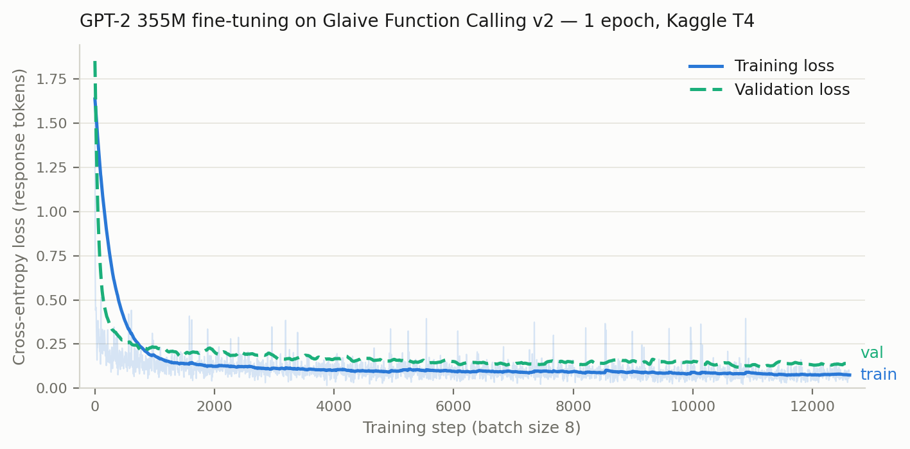

# GPT-2 Function Calling — from scratch

**[🕹️ Try it live](https://huggingface.co/spaces/noFFENSE/gpt2-function-calling)** · [📖 Write-up with animations](https://mron03.github.io/gpt2-function-calling/) · [🤗 Weights](https://huggingface.co/noFFENSE/gpt2-355M-function-calling)

GPT-2 implemented **from scratch in PyTorch** and fine-tuned to do **function calling**: given a JSON function schema and a user request, the model decides whether to call the function and emits a parseable `<functioncall>` JSON payload with the right arguments.

No Hugging Face `transformers`, no PEFT — the transformer, the weight loading from OpenAI's original TF checkpoints, the training loop, and the evaluation harness are all hand-written. Based on the methodology of Sebastian Raschka's *Build a Large Language Model From Scratch* (ch. 7), extended from instruction tuning to structured function calling.

```text
###SYSTEM: You are a helpful assistant with access to the following functions. Use them if required -
{
    "name": "get_current_weather",
    "description": "Get the current weather for a location",
    "parameters": { ... "location": {"type": "string"} ... }
}
###USER: What's the weather like in Almaty right now?
###ASSISTANT: <functioncall> {"name": "get_current_weather", "arguments": '{"location": "Almaty"}'}   ← model output
```

## Results

GPT-2 **355M** fine-tuned for 1 epoch on the full Glaive Function Calling v2 dataset (112,960 samples, Kaggle T4, ~9.4 h). Evaluated on the full held-out test split — 3,929 well-formed dialogs, 1,856 of which have a function call in the ground truth; metrics are strict — an unparseable prediction counts as an error in every row.

| Metric | Value |
|---|---|
| Function-call parse rate | **88.4%** |
| Function name accuracy | **88.0%** |
| Argument keys accuracy | **81.4%** |
| Exact match (name + all argument values) | **77.5%** |

Of the 1,641 predictions that parsed, all but ~8 named the correct function. The main failure mode isn't hallucinated functions — it's the model replying conversationally ("Sure, let me calculate that for you") instead of emitting the call, plus occasional garbled JSON on long nested arguments. Full per-sample outputs: `gpt2fc-eval` writes `results/eval-results.json`; the full-split summary is committed as [`results/metrics-355M-full.json`](results/metrics-355M-full.json) (run on a Kaggle T4 via `cloud/kaggle_eval.ipynb`).



Loss is cross-entropy over **response tokens only** — prompt and padding tokens are masked out with `ignore_index=-100`. Validation loss drops from 2.53 (pretrained baseline) to ~0.13.

### Before / after fine-tuning

Same prompt (the weather example above), same greedy decoding — only the weights differ:

| | Model output |
|---|---|
| **Base GPT-2 355M** | No function call — for this prompt, `{` followed by 128 tokens of whitespace. On other prompts it parrots the schema back or invents its own JSON: a web-text predictor continuing a document, with no concept of the dialog format, the tool, or when to stop |
| **Fine-tuned 355M** | `###ASSISTANT: <functioncall> {"name": "get_current_weather", "arguments": '{"location": "Almaty"}'}` — then a clean end-of-text |

One epoch of fine-tuning teaches the *protocol*: answer as the assistant, treat the schema as a callable tool, pull the arguments out of the user's sentence, and stop.

## Project structure

The repo is organized around the three stages of the project:

```text
src/gpt2fc/
├── model/          1️⃣  Manual GPT-2 implementation
│   ├── attention.py       causal multi-head attention
│   ├── layers.py          LayerNorm, GELU (tanh approx.), FeedForward, TransformerBlock
│   ├── gpt2.py            GPTModel: embeddings → N blocks → LayerNorm → LM head
│   └── pretrained.py      download OpenAI TF checkpoints + map weights onto the model
├── training/       2️⃣  Fine-tuning pipeline
│   ├── data.py            Glaive loading & 85/10/5 split, prompt formatting,
│   │                      pre-tokenized Dataset, collate fn with loss masking
│   └── train.py           CLI: fine-tune GPT-2 (124M–1.5B) on Glaive
└── inference/      3️⃣  Inference & evaluation
    ├── generate.py        KV-cached greedy / temperature / top-k decoding
    ├── parser.py          robust <functioncall> JSON extraction
    ├── evaluate.py        CLI: benchmark on the test split
    └── chat.py            CLI: single-turn demo with any function schema

tests/              25 unit tests (model, data pipeline, parser, decoding, config) — no network, no weights
notebooks/          the learning journey: data exploration → architecture → training
cloud/              Kaggle/Colab training & eval notebooks (pip-install the package, run the CLIs) + Azure ML job
demo/               Gradio app behind the hosted Space (base vs fine-tuned, side by side)
```

## How it works

**Model.** GPT-2 architecture written in ~200 lines of PyTorch: learned token + positional embeddings, pre-norm transformer blocks (causal multi-head attention → residual, GELU feed-forward → residual), final LayerNorm, untied LM head. Weights for the 124M–1.5B checkpoints are transferred tensor-by-tensor from OpenAI's original TensorFlow checkpoints, with shape checks on every assignment.

**Data.** Each Glaive sample is a function schema (`system`) plus a dialog (`chat`). `format_entry` rewrites role markers to `###SYSTEM:` / `###USER:` / `###ASSISTANT:` sentinels and splits at the first assistant turn: everything before is the prompt, the assistant turn is the training target. The collate function pads to batch max length, appends EOS, shifts targets by one, and masks prompt + padding tokens so the loss teaches only the assistant's behavior.

**Training.** Plain AdamW (`lr=5e-5`, `weight_decay=0.1`) full fine-tune, batch size 8, sequences capped at 512 tokens. Trained on Kaggle's free T4 (also reproducible on Colab or Azure ML — see `cloud/`).

**Evaluation.** The tricky part is that Glaive (and therefore the fine-tuned model) emits *almost*-JSON: `{"name": "f", "arguments": '{"k": "v"}'}` — the arguments object is wrapped in single quotes. The parser finds the payload span by brace-depth counting (regexes fail on nested objects), then unwraps the single-quoted arguments blob before `json.loads`. On the ground-truth test split this parses **100%** of function calls, vs ~4% for a naive `json.loads`.

## Quick start

```bash
uv venv --python=python3.10 && source .venv/bin/activate
uv pip install -e ".[train,dev]"
pytest                       # 25 tests, runs in ~2s
```

**Demo** (the fine-tuned checkpoint is hosted on [Hugging Face](https://huggingface.co/noFFENSE/gpt2-355M-function-calling) — or skip the download entirely and use the [live Space](https://huggingface.co/spaces/noFFENSE/gpt2-function-calling)):

```bash
huggingface-cli download noFFENSE/gpt2-355M-function-calling \
    gpt2-355M-function-calling.pth --local-dir checkpoints

gpt2fc-chat --checkpoint checkpoints/gpt2-355M-function-calling.pth \
    --user "What's the weather like in Almaty right now?"
```

```text
###ASSISTANT: <functioncall> {"name": "get_current_weather", "arguments": '{"location": "Almaty"}'}

Parsed function call:
{ "name": "get_current_weather", "arguments": { "location": "Almaty" } }
```

You can pass any schema: `--schema '{"name": "book_flight", "parameters": {...}}'`.

**Train** (auto-downloads the pretrained GPT-2 weights on first run):

```bash
# local smoke test (--device cpu: PyTorch MPS backward kernels can emit NaN grads)
gpt2fc-train --data-slice 200 --num-epochs 1 --batch-size 2 --allowed-max-length 256 --device cpu

# full run (CUDA GPU recommended; see cloud/ for Kaggle/Colab/Azure recipes)
gpt2fc-train --model-size 355M --num-epochs 1 --batch-size 8 --data-slice -1
```

Inference and evaluation run fine on Apple Silicon (MPS) — only training gradients hit the MPS kernel bug (verified via `torch.autograd.set_detect_anomaly`: `LinearBackward0` returns NaN; CPU and CUDA are unaffected).

**Evaluate**:

```bash
gpt2fc-eval --checkpoint checkpoints/gpt2-355M-function-calling.pth \
    --model-size 355M --num-samples 200 --output-json results/eval-results.json
```

## What I learned / limitations

- A 355M model trained for one epoch learns the *format* essentially perfectly (near-100% parseable calls) and generalizes to unseen schemas and argument values — but it inherits its training distribution's quirks: it reproduces Glaive's single-quoted arguments style, and it refuses requests (e.g. flight booking) that Glaive's assistants habitually refused.
- Evaluation infrastructure matters as much as the model: a parser bug made a well-trained model look completely broken (4% vs 100% parse rate on identical outputs).

## Acknowledgments

- Architecture and training methodology: [Sebastian Raschka — *Build a Large Language Model From Scratch*](https://github.com/rasbt/LLMs-from-scratch) (Apache 2.0)
- Dataset: [Glaive Function Calling v2](https://huggingface.co/datasets/glaiveai/glaive-function-calling-v2)
- Pretrained weights: OpenAI GPT-2 TF checkpoints

Licensed under [Apache 2.0](LICENSE).
